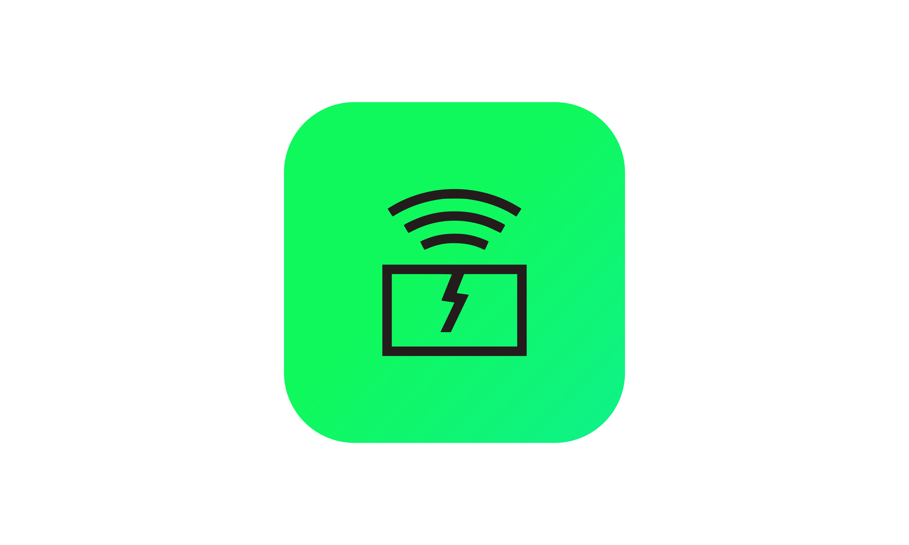

# QuakeGuard

This is an API that allows EarthQuake detection using an Arduino Vibration Sensor Or Dedicated Hardware (Prototyping using Wifi and Bluetooth)

# How to use

- run `python manage.py runserver 0:8000` in order to start the server
- on a different terminal, run `python sensor.py` in order to start listening for the bluetooth events and don't forget to update the MAC address
- make sure that your bluetooth is ON
- make sure that your phone is connected on the same wifi network as the server
- enter your server's ip address in the <a href="https://github.com/zaqks/QuakeGuard_app">QuakeGuard App</a> in order to listen for the events
